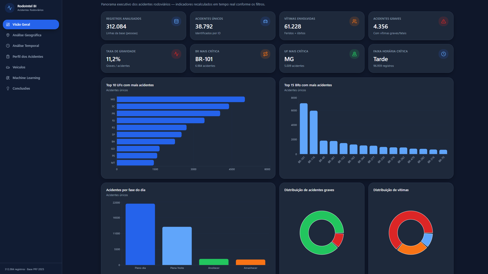
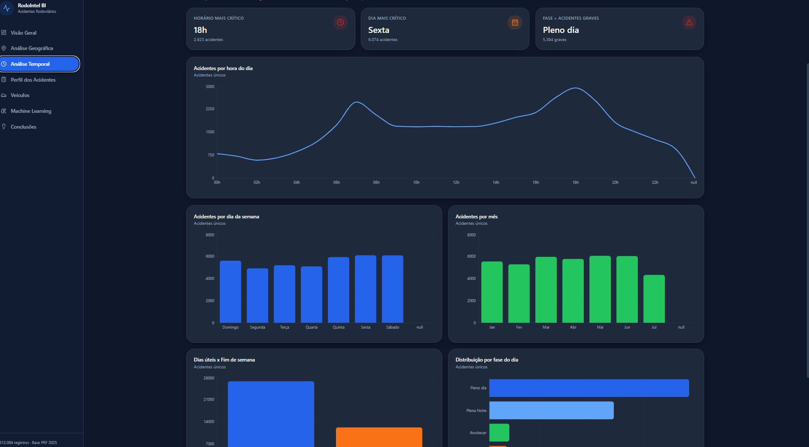
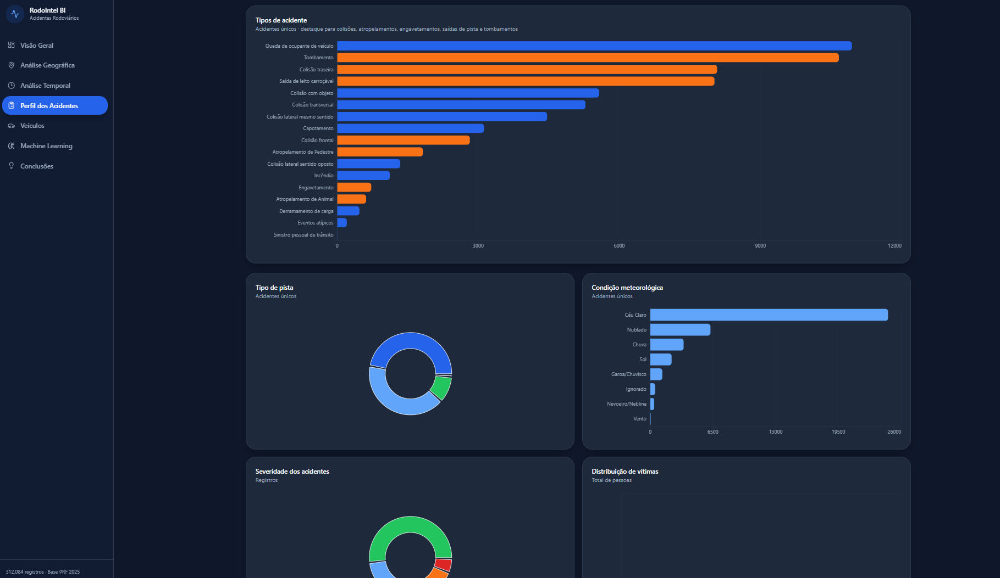
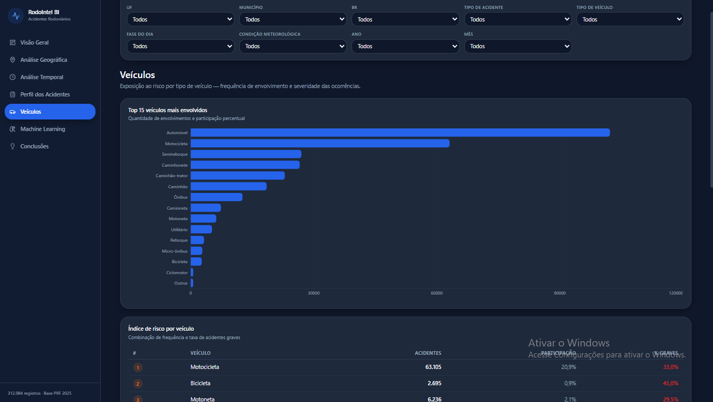
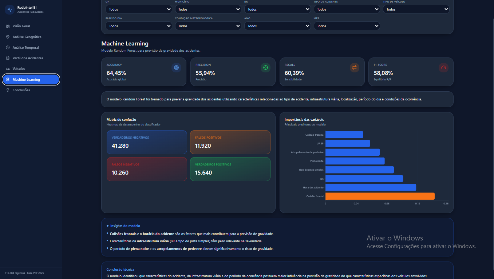
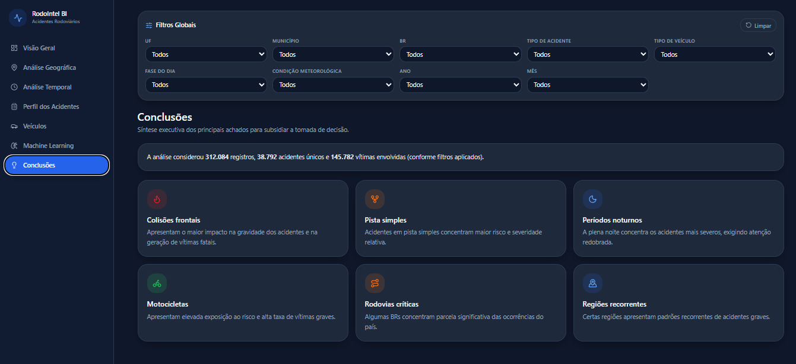

# Road Scan Dashboard

Dashboard interativo para análise de acidentes rodoviários no Brasil utilizando Ciência de Dados, Machine Learning e Business Intelligence.

---

## Visão Geral

---

## Análise Temporal

---

## Perfil dos Acidentes

---

## Veículos

---

## Machine Learning

---

## Conclusões

---

## Dashboard Online

---

## Tecnologias Utilizadas

* Python
* Pandas
* PostgreSQL
* Scikit-Learn
* Random Forest
* React
* TypeScript
* Tailwind CSS
* Plotly

---

## Objetivo do Projeto

O projeto tem como objetivo analisar padrões de acidentes rodoviários no Brasil, identificar fatores associados à gravidade dos acidentes e disponibilizar visualizações interativas para apoio à tomada de decisão.

---

## Principais Funcionalidades

* KPIs executivos
* Mapas interativos
* Análise temporal
* Ranking de BRs críticas
* Ranking de UFs
* Análise de veículos
* Predição de acidentes graves com Random Forest
* Feature Importance
* Dashboard corporativo responsivo
